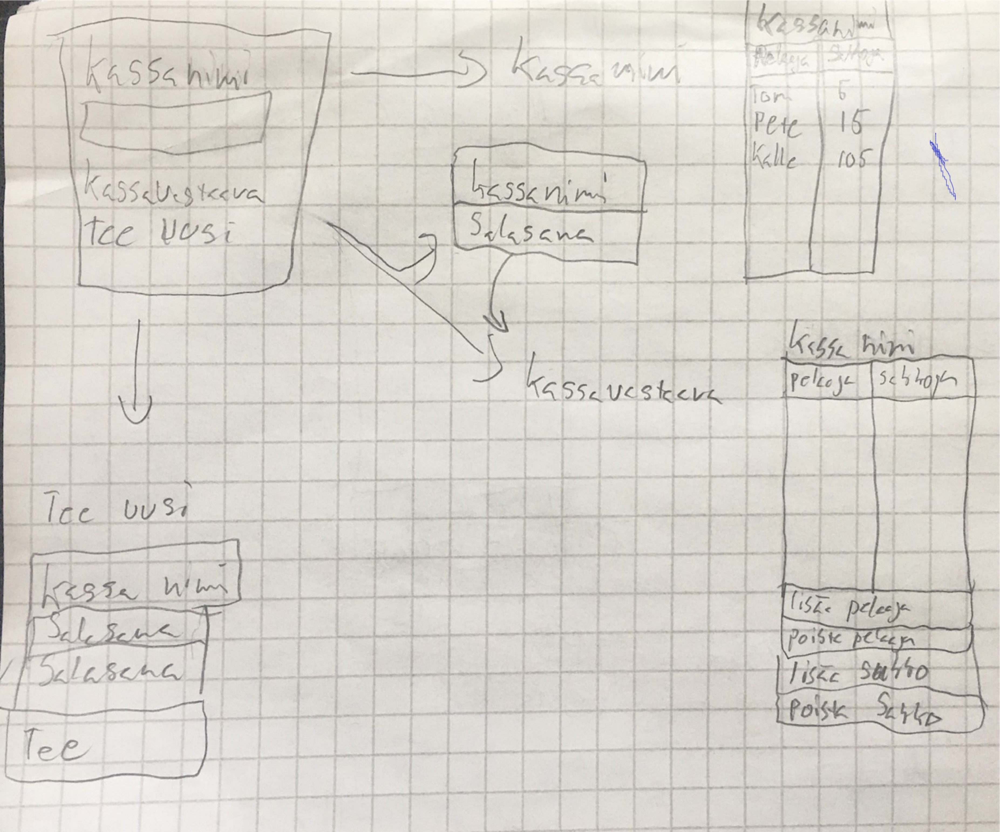

#### **Vaatimusmäärittely**

## **Sovelluksen tarkoitus**

Sovelluksen tarkoitus on tehdä **SakkoKassa**. Eli lista jossa voidaan pitää kirjaa
eri esim. pelaajien sakoista joukkuelajeissa. 
Käyttäjä joka tietää **SakkoKassan** nimen voi tarkastella sitä ja katsoa paljonko hänellä on sakkoja kertynyt.
Käyttäjä voi myös tehdä uuden **SAkkoKassan** jolloin sille pitää antaa salasana.
Jos käyttäjä tekee uuden **Kassan** hänestä tulee **SakkoVastaava**. 
Jos kirjaudut **SakkoVastaavana** ohjelmaan pystyt lisäämään ja poistamaan ""pelaajia"" listasta.
Ja myös lisäämään ja poistamaan sakkoja pelaajilta.
Kassoja voi olla monta ja niitä pääsee seuraamaan jos tietää **Kassan nimen**.
Mutta vain jos olet KassaVastaava ja tiedät salasanan kassaan niin pystyt muuttamaan tietoja.

## **Käyttäjä**

On olemassa "normaali" käyttäjä joka voi katsoa tietyn kassan tilannetta.
"normaali käyttäjä" pystyy myös luomaan uuden kassan jolloin hänestä tulee **SakkoVastaava**.
Käyttäjä **SakkoVastaava** pystyy sitten salasanan kanssa kirjautumaan tiettyyn kassaan jota sitten voi muutta.
Vastaavan kirjautuneena Kassaan pystyy lisämään "nimiä" ja poistamaan "nimiä".
ja myös lisäämään tai poistamaan sakkoja tietylle "nimelle" joka on listassa.

## **käyttöliittymä Luonnos**

Sovellus koostuu neljästä eri näkymästä alku jossa voi tarkastella kassa tilanetta kassan nimellä.
syöttmälllä kassan nimi siirtyy uuteen ikkunaan katsomaan tilannetta kassassa.
kassavastaava nappi johon voi syöttää nimen ja salasanan.
Jolloin uusi ikkuna avautuu missä on nimet ja sakot ja mahdollisuudet lisätä ja poistaa.
ja luo uusi nappi jolloin avautuu uusi ikkuna missä voi tehdä uuden kassan salasanan kanssa.

## **Perusversion tarjonta**

käyttääjän on alussa tehtävä uusi kassa. 
käyttäjän ei ole pakko kirjautua katsoakseen kassan tilannetta.
katsottuaan kassan tilanetta käyttäjä voi myös poistua kassasta.
Kirjautuneena kassavastaavana 
on mahdollisuus lisätä nimiä ja hallinoida sakkoja.
ja myös poistua kassasta.  

## **Jatko kehittelyä**

Kassankokonais suuruus paljonko sakkoja on tullut.
mahdollisuus poistaa kokonaiskassasta jos on käytetty kassaa jonkun maksamiseen.
aika koska eri sakkoja lisätty.
syy miksi sakkoja lisätty.
joitain nopeita nappeja jolla saa helposti vastaavana kirjattua sakkoja nimille.
myös mahdollisuus tulostaa kassa tilanne esim whatapp viestiin.
 

 
