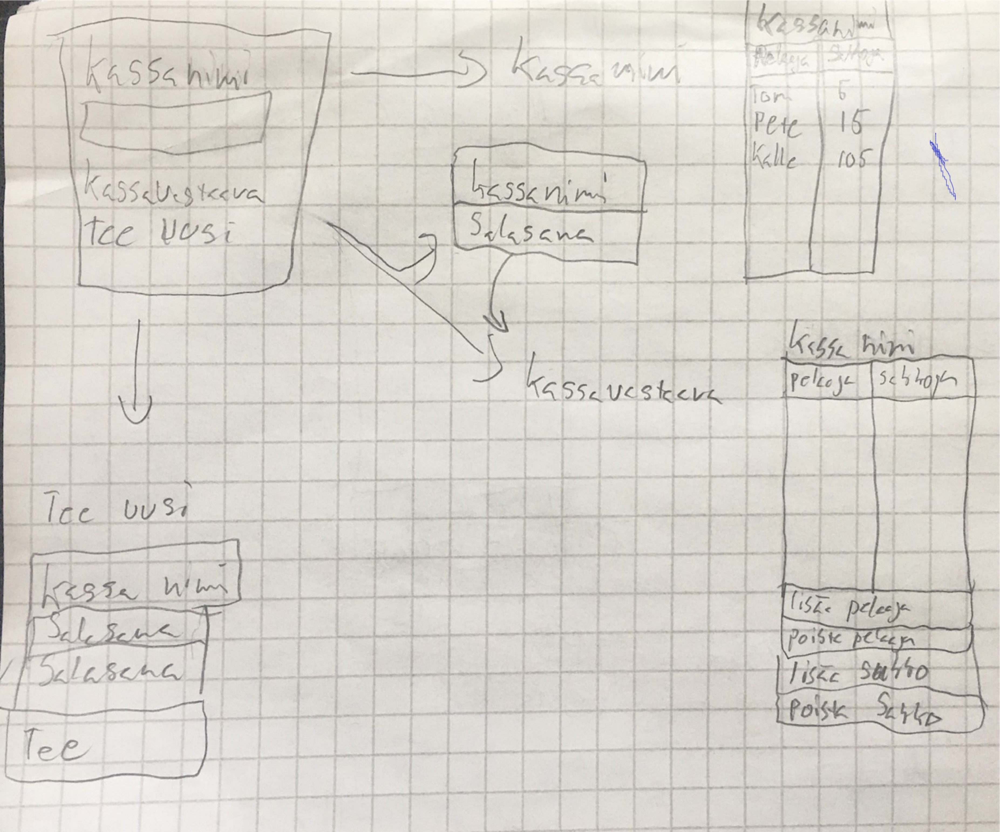

# **Vaatimusmäärittely**

## **Sovelluksen tarkoitus**

Sovelluksen tarkoitus on tehdä **SakkoKassa**. Eli lista jossa voidaan pitää kirjaa
eri esim. pelaajien sakoista joukkuelajeissa. 
Käyttäjä joka tietää **SakkoKassan** nimen voi tarkastella sitä ja katsoa paljonko hänellä on sakkoja kertynyt.
Käyttäjä voi myös tehdä uuden **SAkkoKassan** jolloin sille pitää antaa salasana.
Jos käyttäjä tekee uuden **Kassan** hänestä tulee **SakkoVastaava**. 
Jos kirjaudut **SakkoVastaavana** (Admin) ohjelmaan pystyt lisäämään ""pelaajia"" listaan.
Ja myös lisäämään ja poistamaan sakkoja pelaajilta.
Kassoja voi olla monta ja niitä pääsee seuraamaan jos tietää **Kassan nimen**.
Mutta vain jos olet KassaVastaava ja tiedät salasanan kassaan niin pystyt muuttamaan tietoja.

## **Käyttäjä**

On olemassa "normaali" käyttäjä joka voi katsoa tietyn kassan tilannetta.
"normaali käyttäjä" pystyy myös luomaan uuden kassan jolloin hänestä tulee **SakkoVastaava** (Admin).
Käyttäjä **SakkoVastaava** pystyy sitten salasanan kanssa kirjautumaan tiettyyn kassaan jota sitten voi hallinoida.
Admininä kirjautuneena Kassaan pystyy lisämään henkilöitä.
ja myös lisäämään tai poistamaan sakkoja tietylle henkilölle joka on listassa.

## **käyttöliittymä Luonnos**

Sovellus koostuu neljästä eri näkymästä.
* alkusivu jossa voi joko kirjautua sisään (Login) jos tietää kassan nimen tai sitten tehdä uusi(Create new).
* Create new sivu jossa voi täyttää kassan nimen ja passwordin jolla sitten pystyy kassaa hallinnoimaan.
* Katsomis sivu jossa voi katsella miten paljon sakkoja on maksanut kaudessa ja miten paljon sakkoja on maksamatta. 
Siinä näkyy myös paljonko rahaa kassassa on, ja paljonko vielä kaikilta maksamatta.
*Admin näkymä jossa voi sitten lisätä ja poistaa sakkoja eri pelaajilta. 

## **Toiminnallisuus:**

* Uuden kassan lisääminen (tehty)
* Uuteen kassaan pääsy jos tietää nimen (tehty)
* Passwordin talletus (tehty) 
* Lista pelaajista jotka ovat kassassa ja niiden sakkoja (tehty)
* Jos tiedät passwordin niin mahdollisuus lisätä pelaajia (tehty)
* Jos tiedät passwordin niin mahdollisuus lisätä sakkoja (tehty)
* Poistua sivusta kun valmis (tehty)
* Lista toteutus pelaajista ja sakoista muotoa Nimi / Sakko. (tehty)

## **Perusversion tarjonta**

* Käyttääjän on alussa tehtävä uusi kassa. 
* Käyttäjän ei ole pakko kirjautua katsoakseen kassan tilannetta.
* Katsottuaan kassan tilanetta käyttäjä voi myös poistua kassasta.
* Kirjautuneena kassavastaavana on mahdollisuus lisätä nimiä ja hallinoida sakkoja.
ja myös poistua kassasta.  

## **Jatko kehittelyä**

* Kassankokonais suuruus paljonko sakkoja on tullut. (tehty)
* mahdollisuus poistaa kokonaiskassasta jos on käytetty kassaa jonkun maksamiseen.
* aika koska eri sakkoja lisätty. (tehty)
* syy miksi sakkoja lisätty.
* joitain nopeita nappeja jolla saa helposti vastaavana kirjattua sakkoja nimille.
* myös mahdollisuus tulostaa kassa tilanne esim whatapp viestiin.
 

 
