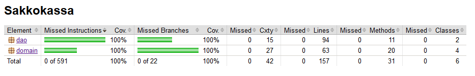

# Testausdokumentti

## SakkokassaPayboxtest

Ohjelmaa on testattu kahdella eri testi-paketilla.
Toisessa tehdään Joukkueitten eri salasanojen ja nimien testejä.
esimerkiksi kahta samaa ei pysty lisäämään tyhjää ei pysty lisäämään ja niin edelleen.
tässä olen luonnut testeihin yhden taulukon jonka sitten teardownissa pystyn poistamaan ja testit voidaan tehdä uudestaaan.
Tämän takia voi myös tehdä testit tietokantaan koska ne poistetaan jokaisen testin jälkeen.

## SakkokassaPlayersTest

Tässä luodaan uusia tietokantoja tietyillä nimillä jotka myöhemmin teardownissa poistetaan jotta testejä pystyy suorittamaan uudestaan.
Myös virhe syöteittä on tässä otettu huomioon kuten esimerkiksi tyhjiä syötteitä tai joukkue vain numeroilla.

### Dao-SQlluokat
on myös testattu juuri näiden teardownien ansiota niin ne pystyv't suorittamaan useamman kerran.

## Järjestelmätestaus
Sovellusta on kokeiltu OSX- ja Linux-ympäristöissä.

## Testikatavuus
testikattavuudessa on otettu kaikki luokkien dao ja domain metodeja huomioon.

