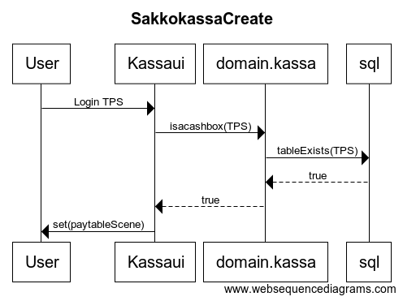
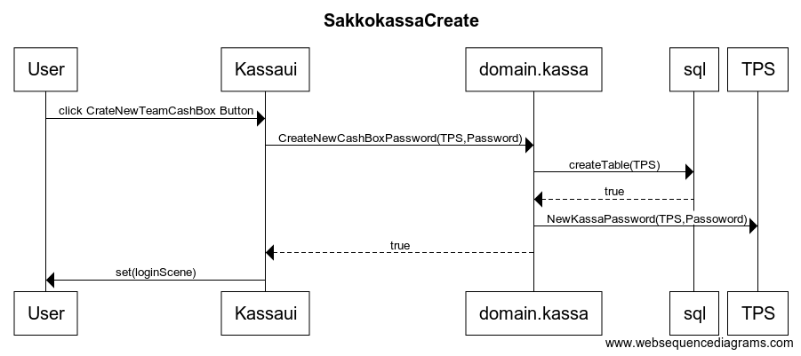

# Arkkitehtuurikuvaus

##´Rakenne

Olen tehnyt pakkaukset:
* Sakkokassa.kassaui
* Sakkokassa.domain
* Sakkokassa.sql 

Kassaui pitää huolta käyttöliitymästa.
Ja kysyy domain pakkauksesta eri metodeja.
domain taa sen sijaan tallentaa sql tietoja jotta ne pysyy tiedossa.
sql luokasta voidaan sitten myös kysyä eri tietoja ja sen avulla pidetään kirjaa tiedoista.

## Käyttöliittymä

Liittymässä on kolme eri näkymää
* Alku näkymä missä on login, create new 
* Jos create new niin create new näkymä. Missä on nimi ja salasana palkit.
* Jos tiedät kassan nimen niin voit loginin avulla. kirjautua sisään johon tulisi näkyviin pelaajat ja sakkojen koot.
* Kassa näkymässä voi sitten täyttää password tiedon. jolloin näkymään tulee näkyviin add player ja add sakko. 

## Käyttöliittymäluonnos
SakkokassaLogin

Käyttäjä haluaa kirjautua jollekin kassalle pitää tietää nimi. kuvassa henkilö menee sisälle Tps sakkokassaan
kassaui kysyy domainilta jos tps on kassa. domain vuorostaan kysyy sql:lltä jos on joka palauttaa true koska Tps on kassa.
Tämän jälkeen siirytään CashBoxScenen jossa näkyy tietoja.

käyttäjä painaa nappia create jossa tulee näkyviin kaksi tekstipalkkia toisessa on joukkue ja toisessa salasana.
kun täytä nämä ja painaa create nappia niin kassui kysyy domainilta jos voi lisätä domain kysyy taas sql:lltä 
jos ei ole olemassa samannimista kassaa niin sql palauttaa true ja lisää tämän kassan tietokantaan.
Domain joka saa vastauksen true. tallentaa salasanan jonka sitten myöhemmin voidaan kysyä.
ja palauttaa true myös. 
Tämän jälkeen ohjema alautuu loginScenen josta sitten voi jatkaa CashBoxScenen joka käytiin läpi.

**uusien pelaajien lisäämistä ja sakkojen lisäämistä en ole vielä aloittanut**
tarkoitus aloittaa ensi viikolla.

## Sovelluslogiikka

En ole ihan vielä miettinyt valmiiksi miltä tulee näyttämään mutta idea on 

* boolean newCashboxandpassword()
* boolean isCashbox() 
* boolean checkPassword()

näillä pystyis sitten sovelluslogiikassa liikkumaan ikkunasta toiseen
Miten teen listan josta näkyy kassan sisällön on vielä auki. 
ja miten teen lisäämiset ja poistot tulee vielä.

## Tietojen Pysyväistalletus

Siinä käytän sql Tietokantaa ja tallenan siihen tietoa eri taulukoista ja sakkojen suuruuksista.

  
