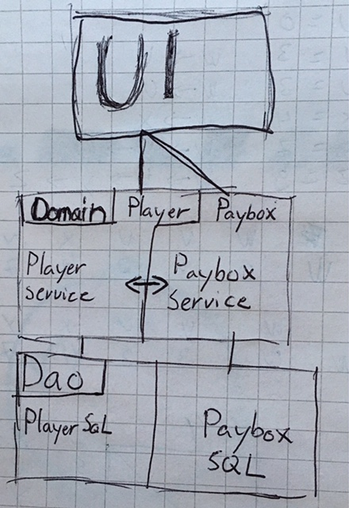

# Arkkitehtuurikuvaus

## Rakenne

Olen tehnyt pakkaukset:
* Sakkokassa.kassaui
* Sakkokassa.domain
* Sakkokassa.sql 

Kassaui pitää huolta käyttöliitymästa.
Ja kysyy domain pakkauksesta eri metodeja.
domain taa sen sijaan tallentaa sql tietoja jotta ne pysyy tiedossa.
sql luokasta voidaan sitten myös kysyä eri tietoja ja sen avulla pidetään kirjaa tiedoista.

## Käyttöliittymä

Liittymässä on neljä eri näkymää
* Alku näkymä missä on login, create new 
* Jos create new niin create new näkymä. Missä on nimi ja salasana palkit.
* Jos tiedät kassan nimen niin voit loginin avulla. kirjautua sisään johon tulisi näkyviin pelaajat ja sakkojen koot.
* Kassa näkymässä voi sitten täyttää password tiedon. jolloin uuteen ikkunaan tulee näkyviin mahdollisuus lisätä ja vaihtaa sakkoja. 
* "Admin" näkymässä voi sitten lisätä pelaajia tai muokata sakkoja.

## Käyttöliittymäluonnos

SakkokassaLuokkakaavio

Meillä on käytössa ui osuus joka on vain käyttöliitymän näkymä.
Domainissa on kaksi eri osaa Players ja Paytables
jossa voidaan käsitellä molempien toiminnallisuuksia.
molempien työ on tarkoitus tehdä tässä osassa.
Lopuksi meillä on DaoSQL myös Players ja Paybox
osa johon sitten tallenetaan tietokantaan tietoa pelaajista, summista ja eri kassoista mitä pitää tallentaa.

SakkokassaLogin

Käyttäjä haluaa kirjautua jollekin kassalle pitää tietää nimi. kuvassa henkilö menee sisälle Tps sakkokassaan
kassaui kysyy domainilta jos tps on kassa. domain vuorostaan kysyy sql:lltä jos on joka palauttaa true koska Tps on kassa.
Tämän jälkeen siirytään CashBoxScenen jossa näkyy tietoja.

käyttäjä painaa nappia create jossa tulee näkyviin kaksi tekstipalkkia toisessa on joukkue ja toisessa salasana.
kun täytä nämä ja painaa create nappia niin kassui kysyy domainilta jos voi lisätä domain kysyy taas sql:lltä 
jos ei ole olemassa samannimista kassaa niin sql palauttaa true ja lisää tämän kassan tietokantaan.
Domain joka saa vastauksen true. tallentaa salasanan jonka sitten myöhemmin voidaan kysyä.
ja palauttaa true myös. 
Tämän jälkeen ohjema alautuu loginScenen josta sitten voi jatkaa CashBoxScenen joka käytiin läpi.

## Sovelluslogiikka

Minulla on player ja PayboxService domain luokassa jossa playersService sisältää:
* boolean addPlayer()
jolla voi lisätä pelaajia.
* void uppdateplayer() 
jolla voi vaihtaa summaa pelaajalta.
* ArrayList<String> getAll()
joka palauttaa merkkijonona ("nimi" ja paljonko "velkaa" ja paljonko maksettu yhteensä ja last Uppdate)
Payboxservice:
* boolean Login()
joka kirjaasisään tietyn käyttäjän jos on olemassa.
boolean createUser()
joka luo uuden käyttäjän jos ei ole aikaisemmin olemassa.
näillä on tarkoitus hallinoida kassoja ja vaan näyttämään UI mitä se kysyy.

## Tietojen Pysyväistalletus

Siinä käytän kahta eri sql Tietokantaa 
*Teams
Jossa payboxes tietokanta joka tallentaa (nimi,salasana) taulukkoon.
tästä voi tehdä kyselyjä josta saa tiedot.

* teamPlayers
tässä jokainen joukkue luo oman taulukon jossa on pelaajille
(nimi,velkaa,summa) tästä sitten pystyy eri kyselyjen kanssa saamaan tietoja eri pelaajista.

## Heikkoudet

kassaui jossa on MainSakkoKassa joka huoltaa GUI:ta on todella sekava.
Siihen pistäisin enemmän aikaa jos olisi. Olen laittanut enemmän aikaa siihen että ohjelma toimii kuin GUI:n ulkonäköön ja helppoon hallintaan.
Dao luokkaan kun tallennan joukkueita laitan ne toUppercase jotta ei samanlaisia joukkueita voisi olla monta.
tämän voisi jotenkin korjata niin että tämä pystyis palauttamaan Niin kirjoitetuna kun on syötetty.
samoin olen tehnyt eri Players lisäämisessä. joka vain helpottaa vahinkosyötteiden tekoa.
Sql kyselysiisä on myös hieman copypastea mikä voisi mahdollisesti poistaa. 
Ja Testipaketit voisi vielä jakaa domain ja dao paketeiksi.
  
