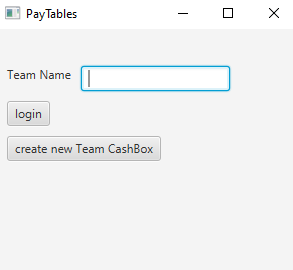
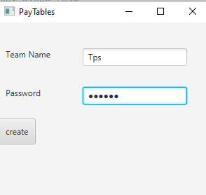
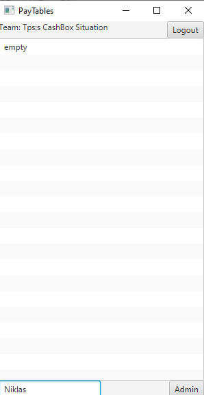
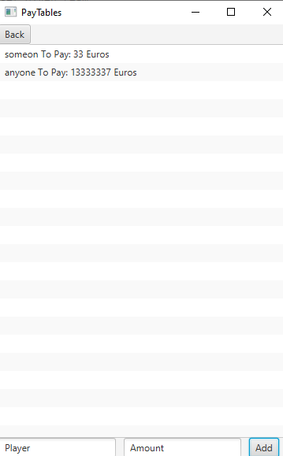

# käyttöohje

## Ohjelma vaatii:
* Käyttäjällä on asennettuna Java 11 tai uudempi malli.

## Ohjelman käynnistäminen
ohjelma voidaan käynnistää komennolla 
*mvn compile exec:java -Dexec.mainClass=main.Main*
Lataamalla releases viikko 7 jar tiedoston 
tai netbeansin kautta.

## Alkunäkymä
Sovellus käynnistyy ensimmäiseen näkymään missä on joko login tai create new paytable
jos tiedät jonkun login voit suoraan siirtyä eteenpäin täyttämällä login.
Jos olet uusi käyttäjä joudut tekemään uuden create paytable napilla.

## Create näkymä

create näkymässä voi lisätä uuden joukkueen ja sille salasanan täyttämällä 
name ja password. 
* name pitää alkaa kirjaimella ja olla yli 2 merkkiä pitkä.
* salasana voi olla mitä vaan kunhan vähintään 4 merkkiä.

## Seuraus näkymä

jos vain tietää joukkueen nimen eikä salasanaa voi tästä näkymästä katso mitä 
sakkoja on meneillä ja kenellä mitä sakkoja.
Myös kassan rahamäärän ja maksamattomien sakkojen määrä näkyy.
Kuin myös koska viimeksi päivitetty eri pelaajille.

## Admin näkymä

Admin näkymään pääset täyttämällä admin salasanan edellisen näkymän alakulmassa.
Admin näkymässä voit sitte hallinoida pelaajia ja summia.
Jos pelaaja on maksanut sakon tai osan sakosta sen voi poistaa merkitsemällä ( - ) miinus ennen määrää.
Esim. PELAAJA: ToPay 10 Alltime 10 Euroa.

täyttämällä  (Pelaaja , -10 )

saadaan PELAAJA ToPay 0 Alltime 10 Euroa

tästä näkymästa pääset pois back napilla. 

